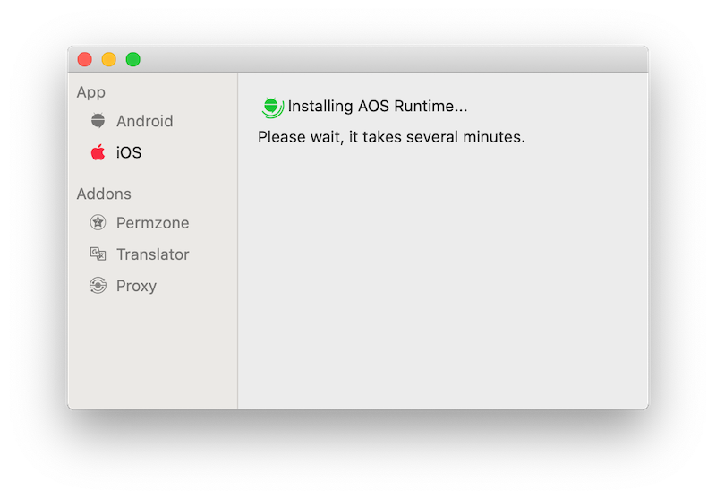
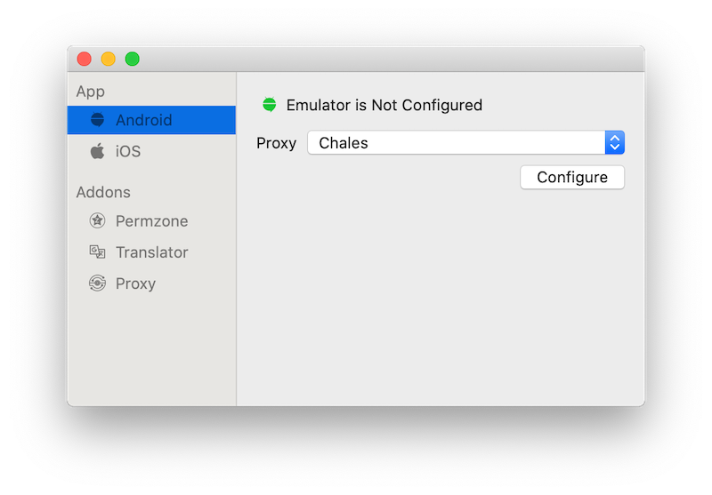
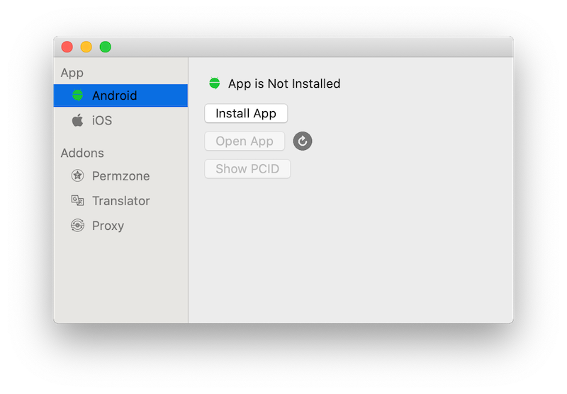

# Coupang Mobile App
A wrapper for AOS emulator and iOS simulator. 

# Requirements
Xcode should be installed

# Features
- Android emulator is included into the application. No extra dependencies.
- Manages perm zones.
- Translates http requests from Korean to English.
- Automatically manages Charles proxy certificates.
- Manages proxy settings.
- Shows app `PCID`.

# Installation
1. download [AOIOMI](https://coupang-my.sharepoint.com/:u:/p/vlsolome/EQ5UqQTLqo1LqCg6dRaxuBMBQlUy5iWTBt9q2xVcxKA0qw?e=L4ZyfG)
2. move `AOIOMI.app` into the `~/Applications` folder

# Usage

## Emulator/Simulator configuration
1. On the first start the app will download and install Android runtime. It takes several minutes, be patient.

2. Next you need to configure emulator and simulator. Choose a proxy to use and click `Configure button`.

## Install Coupang app
Click `Install App` button for AOS/iOS app.

>Note: `ipa` files are not supported. Ask your iOS buddy about simulator build.

## Problems?
If simulator/emulator fails to start.
 - Stop emulator/simulator.
 - Reconfigure it.
 - If reconfigure doesn't work, reboot your laptop🥴
 

## Still problems?
@vlsolome
