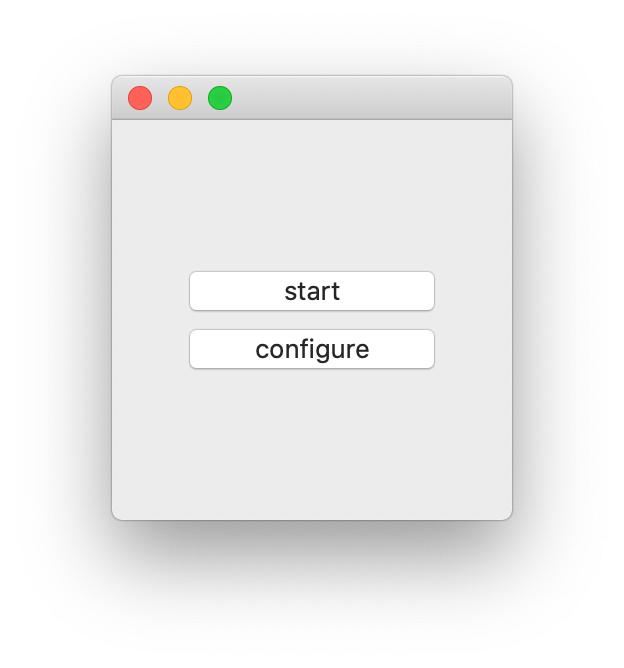
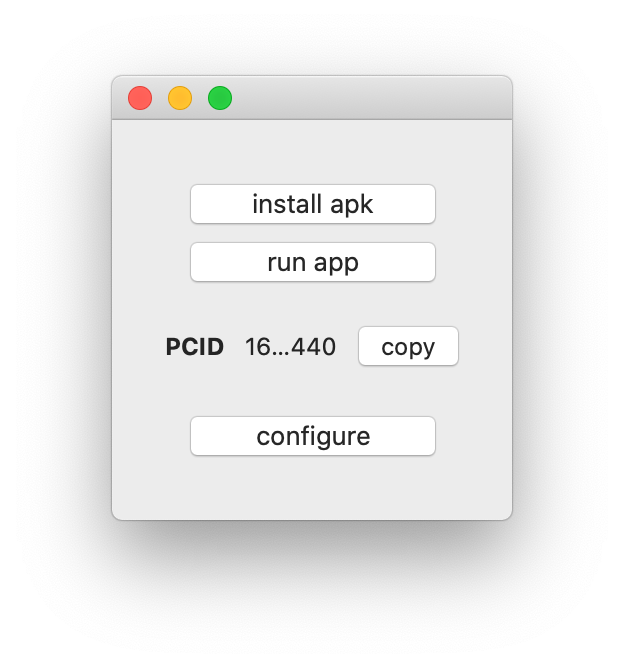

# Coupang Mobile App

This is a wrapper for android emulator. It doesn't have any external dependencies.
Emulator is preconfigured with `Charles` certificates and proxy settings.

# Installation
1. install `Charles` proxy
2. download [CoupangMobileApp](https://github.coupang.net/vlsolome/CoupangMobileApp/releases/latest/download/CoupangMobileApp.zip)
3. move `CoupangMobileApp.app` into the `Applications` folder

# Usage

## Start emulator
Click `start` button.

## Install Coupang app
Click `install apk` button.

## Problems?
Click `configure` button.

## Still problems?
@vlsolome

