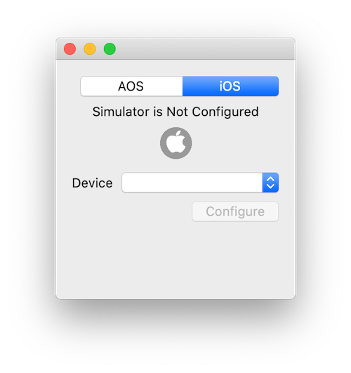
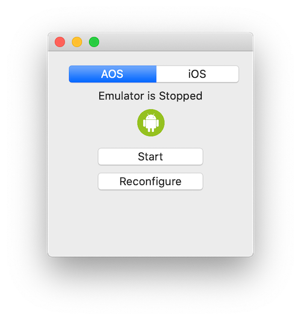
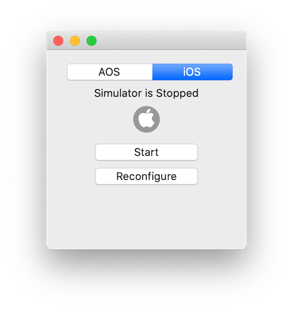

# Coupang Mobile App
A wrapper for AOS emulator and iOS simulator. 

# Requirements
Xcode should be installed

# Features
- AOS emulator is included into the application. No extra dependencies.
- If Charles proxy is installed:
 - Certificates will be installed both into iOS simulator and AOS emulator.
 - AOS emulator will have correct proxy host/port settings.
 - iOS simulator comes without proxy settings, but the app will be configured to use Charles proxy. 
   > Note: it only proxies api calls, web loads might be missed.
 - Shows app PCID.

# Installation
1. download [CoupangMobileApp](https://github.coupang.net/vlsolome/CoupangMobileApp/releases/latest/download/CoupangMobileApp.zip)
2. move `CoupangMobileApp.app` into the `~/Applications` folder

# Usage
On the first start you need to configure emulator and simulator. Just click `Configure button`.
| AOS  | iOS |
| ------------- | ------------- |
|  |   |

## Install Coupang app
Click `Install App` button for AOS/iOS app.
| AOS  | iOS |
| ------------- | ------------- |
|  |   |

>Note: `ipa` files are not supported. Ask your iOS buddy about simulator build.

## Problems?
If simulator/emulator fails to start.
 - Try to reconfigure it.
 - If reconfigure doesn't work, reboot your laptop🥴

| AOS  | iOS |
| ------------- | ------------- |
|  |   |
 

## Still problems?
@vlsolome
